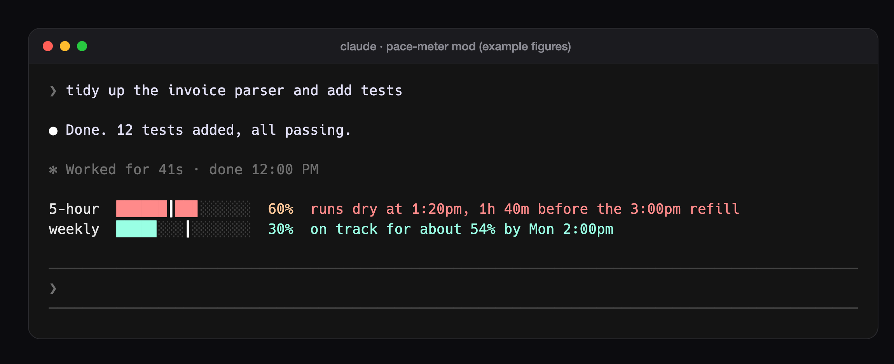

# claude-mods

Claude Code mods by S Triyambaka Patro ([@Triyambak_CA](https://x.com/Triyambak_CA)).

A mod is a small plugin that changes Claude Code itself: what it shows and how it behaves. Add this
catalogue once inside Claude Code, then install any mod from it:

```
/plugin marketplace add Triyambak-CA/claude-mods
/plugin install <mod>@triyambak-mods
```

Start a new session after installing; mods load when a session starts.

## Mods

| Mod | What it does | Install |
|---|---|---|
| [pace-meter](plugins/pace-meter/) | A pace bar and a forecast for your plan's 5-hour and weekly limits, just above the prompt: will the limit last until it refills, and if not, when does it run dry? | `/plugin install pace-meter@triyambak-mods` |



Each mod's folder has its own README with what it needs, its caveats, and how to run its tests
(`claude plugin validate` and `claude plugin test`).

Mods are an early-access Claude Code feature: an update may change the API a mod uses.

## Licence

MIT, see `LICENSE`.
